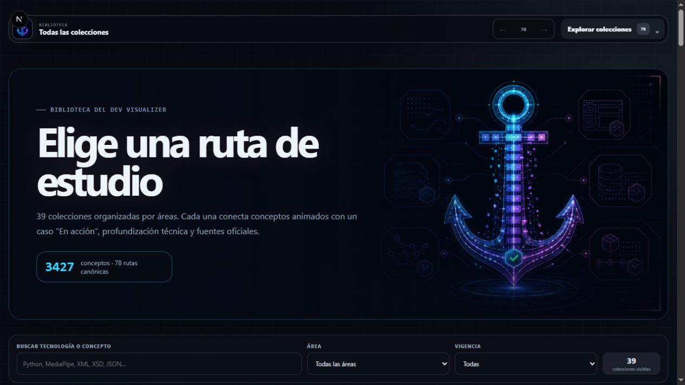
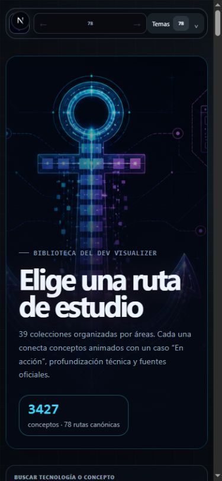
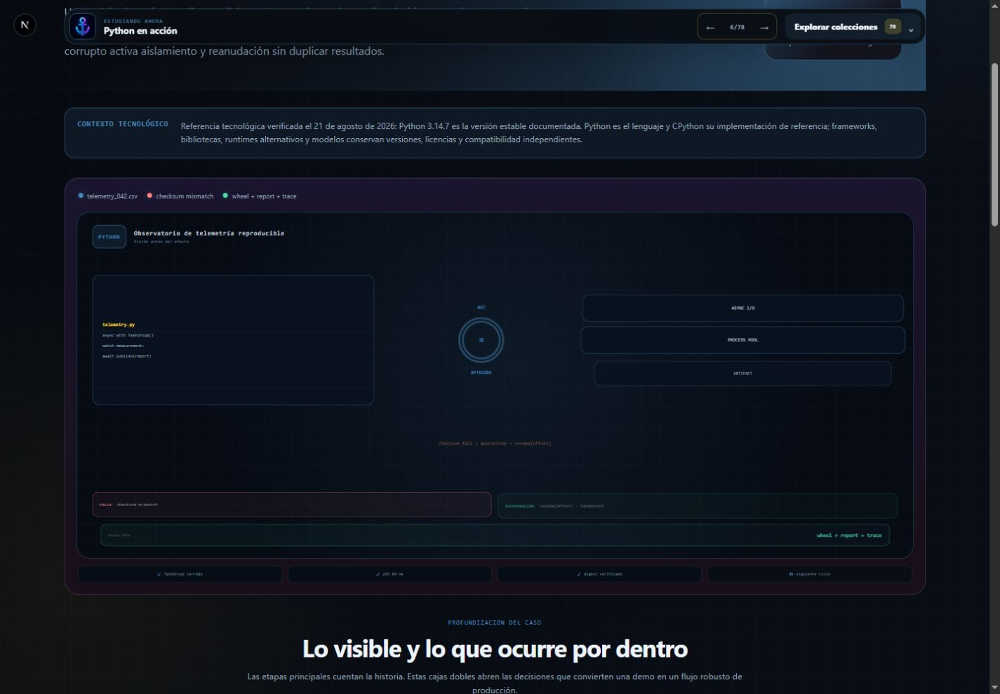
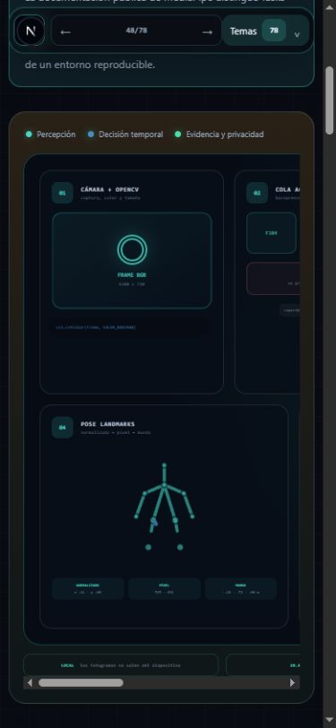

# Dev Visualizer

Atlas visual animado para aprender desarrollo de software desde los fundamentos hasta producción.

**41 colecciones · 82 rutas canónicas · 3,697 conceptos · 41 casos integrados**

<p align="center">
  <a href="https://luics415.github.io/Dev-Visualizer/"><strong>Abrir Dev Visualizer</strong></a>
  ·
  <a href="https://luics415.github.io/Dev-Visualizer/colecciones/">Explorar las 41 colecciones</a>
  ·
  <a href="https://luics415.github.io/Dev-Visualizer/acerca/">Acerca del proyecto</a>
</p>

<p align="center">
  
  <br /><sub>Tarjeta Open Graph oficial del proyecto.</sub>
</p>

Dev Visualizer transforma mecanismos técnicos en escenas autónomas: cada concepto hace visibles la entrada, la transformación interna, el resultado y la conclusión. Cada colección tiene además un caso **En acción** con fronteras, fallo, recuperación y evidencia verificable.

## Vista del producto

<table>
  <tr>
    <td width="66%">
      
      <br /><sub>Biblioteca completa en escritorio.</sub>
    </td>
    <td width="34%">
      
      <br /><sub>Catálogo responsive a 390 × 844.</sub>
    </td>
  </tr>
  <tr>
    <td width="66%">
      
      <br /><sub>Python En acción: runtime, cuarentena y reanudación.</sub>
    </td>
    <td width="34%">
      
      <br /><sub>MediaPipe En acción con desplazamiento local.</sub>
    </td>
  </tr>
</table>

Las capturas documentan una compilación real del proyecto y forman parte del contenido original licenciado bajo [CC BY-NC-SA 4.0](LICENSE-CONTENT.md).

## Qué distingue al atlas

- **Causalidad antes que decoración.** El movimiento representa datos, memoria, mensajes, control, ownership o evidencia.
- **Dos niveles por tecnología.** La colección explica conceptos; **En acción** conecta un caso técnico completo sin repetir la bibliografía de estudio.
- **Fuente primaria por concepto.** Los 3,697 conceptos resuelven al menos dos referencias oficiales o especificaciones visibles.
- **Escenas que no terminan apagadas.** Los loops conservan un estado base legible, regresan semánticamente al inicio y se pausan fuera del viewport.
- **Accesibilidad como contrato.** Teclado, foco visible, estados no dependientes solo del color, vista estática para movimiento reducido y overflow local en escenas extensas.
- **Fronteras tecnológicas explícitas.** Git no es GitHub; CI/CD no es Deployment; Python no es MediaPipe; XML, XSD y JSON tienen responsabilidades y rutas separadas.

## Catálogo

| Área | Colecciones |
|---|---|
| Lenguajes | JavaScript, TypeScript, Python, Prolog, C, C++, C#, Objective-C, C*, CWEB, Embedded C y Visual Basic .NET |
| Diseño e interfaces | UX/UI, HTML y CSS, Bootstrap, AngularJS, React y React Native |
| Plataformas y servidor | APIs, Backend, Node.js, Laravel, n8n, .NET, MediaPipe y Firebase |
| Datos | XML, XSD, JSON, Gestión de estado, Bases de datos y Microsoft SQL Server |
| Control de versiones y calidad | Git, GitHub y Debugging |
| Infraestructura y entrega | Linux, AWS, CI/CD, Deployment, NGINX y Docker |

Cada colección dispone de dos identidades canónicas:

```text
/<colección>
/<colección>-en-accion
```

Las antiguas URLs `/git-github*`, `/apis-rest*` y `/xml-xsd-json*` se conservan como seis puentes accesibles. No cuentan como colecciones ni cambian la identidad de las nuevas rutas.

### Rutas de estudio ampliadas

| Colección | Capítulos | Conceptos | Alcance |
|---|---:|---:|---|
| Python | 48 | 240 | Desde algoritmo, terminal y sintaxis hasta internals, concurrencia, web, datos, IA, seguridad y operación |
| MediaPipe | 24 | 120 | Tasks, modelos, running modes, grafos, visión, audio, texto, edge, rendimiento y uso responsable |
| XML | 22 | 110 | Documentos, namespaces, parsing seguro, XPath, XSLT, catálogos, firma y evolución |
| XSD | 20 | 100 | Tipos, facets, identidad, composición, assertions, PSVI, compatibilidad y conformidad |
| JSON | 22 | 110 | Sintaxis, JSON Schema, Pointer, Patch, precisión, seguridad, canonicalización y operación |
| Prolog | 24 | 120 | Desde términos y unificación hasta CLP(FD), tabling, depuración, concurrencia e integración |
| Microsoft SQL Server | 24 | 120 | T-SQL, almacenamiento, planes, transacciones, seguridad, continuidad y operación |
| AWS | 18 | 228 | Nube, identidad, red, compute, datos y seis recorridos nuevos derivados de apuntes de arquitectura y operación |

Python incluye documentación oficial para personas principiantes y avanza de forma progresiva. MediaPipe usa Python en su caso práctico, pero mantiene currículo, fuentes, ruta y escena propios. Del mismo modo, XML define documentos, XSD define schemas XML y JSON define una sintaxis de valores; una colección no sustituye a las otras.

## Narrativa En acción

Las 26 colecciones incorporadas mediante el registro escalable usan composiciones visuales propias. Entre ellas hay una mesa forense de memoria para C, estación de ownership para C++, switchboard del runtime para Objective-C, cuadrícula térmica para C*, libro-telar para CWEB, osciloscopio para Embedded C, constelación de prueba con backtracking para Prolog, patio ferroviario de locks y LSN para SQL Server, puerto multimodal para APIs, puerto del event loop para Node.js, palacio transaccional para Laravel, aeropuerto de workflows para n8n, estratos de historial para Git y cámara de gobernanza para GitHub.

Los guiños a League of Legends y Arcane se limitan a microcopy original y referencias ambientales. No se usan personajes, audio, logotipos, mapas ni recursos de Riot Games, y no se sugiere afiliación.

## Arquitectura

El sitio utiliza Next.js App Router, React, TypeScript y Motion. `output: "export"` produce HTML, CSS y JavaScript estáticos para GitHub Pages.

```text
src/data/collectionManifest.ts
  └─ identidad, orden, grupo, rutas, tema y vigencia

src/data/expandedCollections.ts
  └─ registro de primers, capítulos, conceptos y casos ampliados

src/data/officialReferences.ts
  └─ autoridades, versiones y resolución de referencias por concepto

src/data/catalogValidation.ts
  └─ invariantes de 41 colecciones y 3,697 conceptos

src/app/[slug]/page.tsx
  └─ 52 rutas expandidas generadas con parámetros cerrados

src/components/visual/useScenePlayback.ts
  └─ viewport, visibilidad de pestaña y movimiento reducido
```

Las otras 30 rutas canónicas conservan sus componentes especializados. La biblioteca del cliente recibe únicamente el manifiesto ligero y estadísticas calculadas; no importa los módulos educativos grandes.

Más contexto:

- [Arquitectura](docs/ARCHITECTURE.md)
- [Guía editorial](docs/CONTENT_GUIDE.md)
- [Sistema visual](docs/VISUAL_SYSTEM.md)
- [Roadmap](docs/ROADMAP.md)
- [Publicación](docs/DEPLOYMENT.md)

## Desarrollo local

Requisitos: Node.js 24 y npm.

```bash
npm ci
npm run dev
```

Validación completa:

```bash
npm run check
```

`npm run check` ejecuta ESLint, TypeScript estricto, la exportación estática y la comprobación de enlaces internos. La compilación actual produce **93 páginas HTML**: 82 canónicas, seis puentes heredados y cinco páginas de soporte.

### Evidencia de calidad

| Control | Resultado esperado |
|---|---|
| Catálogo | 41/41 colecciones; IDs y slugs únicos |
| Currículo | 3,697/3,697 conceptos con capítulo y escena efectiva |
| Fuentes | 3,697/3,697 conceptos con al menos dos referencias primarias |
| Casos | 41/41 pares colección / En acción con profundización |
| Exportación | 93 páginas estáticas y cero enlaces internos rotos |
| Responsive | Sin overflow global; escenas anchas usan scroll local |
| Movimiento | Loop infinito visible, pausa fuera del viewport y estado completo con `prefers-reduced-motion` |

## Añadir o modificar una colección

1. Registrar identidad, grupo, rutas, tema, vigencia y resumen en `collectionManifest.ts`.
2. Crear primer, capítulos, conceptos y caso integrado en un módulo de datos.
3. Incorporar la definición al registro de servidor `expandedCollections.ts`.
4. Resolver fuentes oficiales, especificaciones, versión y fecha de verificación en `officialReferences.ts`.
5. Implementar una escena que represente el mecanismo y cierre su loop con un resultado legible.
6. Ejecutar `npm run check` y validar escritorio, 390 × 844, teclado, tacto, movimiento reducido, overflow y consola.

Las validaciones de build rechazan IDs o rutas duplicados, capítulos vacíos, conceptos sin escena, cobertura documental incompleta y casos sin etapas.

## Publicación y mantenimiento

`.github/workflows/deploy-pages.yml` construye y publica `out/` después de cada actualización de `main`. El workflow calcula `basePath` y `NEXT_PUBLIC_SITE_URL` para que rutas, recursos y metadatos funcionen bajo `/Dev-Visualizer/`.

Las versiones activas se revisan contra fuentes primarias al cerrar cada expansión. Las tecnologías legadas o históricas muestran un aviso visible con contexto y alternativas. Dev Visualizer es material educativo: no reemplaza documentación oficial, evaluación profesional ni guías de seguridad específicas de un entorno productivo.

## Autoría, créditos y licencias

| Alcance | Licencia / condición |
|---|---|
| Código fuente | [MIT](LICENSE) |
| Textos educativos, diagramas, escenas, identidad visual y capturas | [CC BY-NC-SA 4.0](LICENSE-CONTENT.md) |
| Dependencias npm | Licencia declarada por cada paquete |
| Documentación enlazada y especificaciones | Propiedad y términos de sus respectivas autoridades |
| Marcas, nombres y tecnologías citadas | Propiedad de sus titulares; uso nominativo y educativo |

- Dirección, autoría y mantenimiento: **Luics415**.
- Desarrollo y diseño visual: **Sharol (Azlynn)**.
- Asistencia de IA acreditada: **OpenAI ChatGPT**.
- Inspiración narrativa general: [AlgoInsight](https://www.instagram.com/algoinsight/), sin copiar publicaciones, textos, marcas ni recursos.

Consulta [THIRD_PARTY_NOTICES.md](THIRD_PARTY_NOTICES.md) para atribuciones, independencia legal y avisos de terceros.
