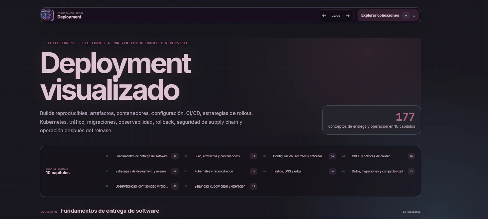
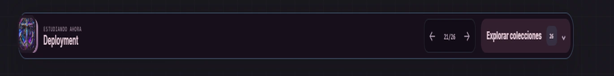
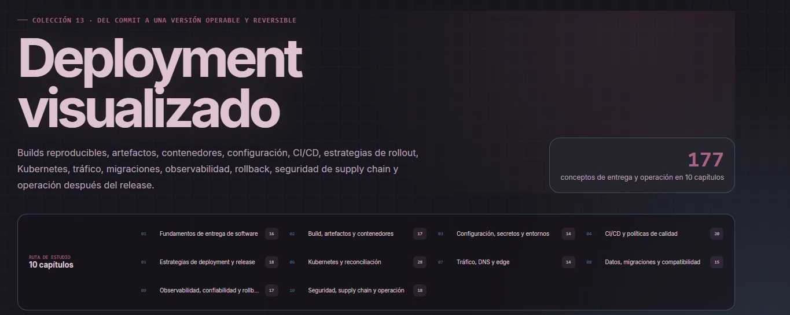
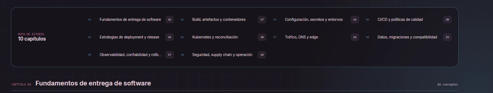
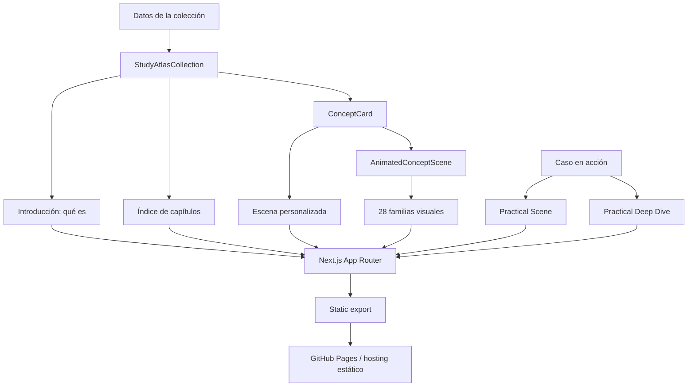
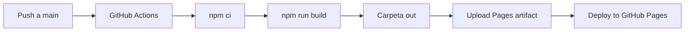

<p align="center">
  
</p>

<h1 align="center">Dev Visualizer</h1>

<p align="center">
  <strong>Atlas visual animado para estudiar desarrollo de software desde los fundamentos hasta producción.</strong>
</p>

<p align="center">
  17 colecciones · 34 rutas de estudio · 2,247 conceptos · 28 familias visuales
</p>

<p align="center">
  Proyecto educativo original · Exportación estática · GitHub Pages · Responsive · Accesible
</p>

---

## Índice

- [Sobre el proyecto](#sobre-el-proyecto)
- [Demo pública](#demo-pública)
- [Capturas de pantalla](#capturas-de-pantalla)
- [Qué problema resuelve](#qué-problema-resuelve)
- [Cómo se estudia dentro del atlas](#cómo-se-estudia-dentro-del-atlas)
- [Colecciones disponibles](#colecciones-disponibles)
- [Características principales](#características-principales)
- [Arquitectura del proyecto](#arquitectura-del-proyecto)
- [Sistema visual](#sistema-visual)
- [Tecnologías](#tecnologías)
- [Estructura de carpetas](#estructura-de-carpetas)
- [Instalación local](#instalación-local)
- [Scripts disponibles](#scripts-disponibles)
- [Publicación en GitHub Pages](#publicación-en-github-pages)
- [Accesibilidad y rendimiento](#accesibilidad-y-rendimiento)
- [Cómo agregar una colección](#cómo-agregar-una-colección)
- [Calidad y validación](#calidad-y-validación)
- [Qué demuestra como proyecto de portafolio](#qué-demuestra-como-proyecto-de-portafolio)
- [Contribuciones](#contribuciones)
- [Autoría y participación](#autoría-y-participación)
- [Licencias y avisos](#licencias-y-avisos)

---

## Sobre el proyecto

**Dev Visualizer** es una biblioteca educativa que transforma conceptos técnicos en explicaciones visuales autónomas. Cada escena intenta mostrar no solo el resultado de una operación, sino también el proceso interno que la produce.

El proyecto nació con una pregunta sencilla:

> ¿Cómo se puede estudiar programación observando lo que ocurre dentro del sistema, en lugar de memorizar únicamente definiciones?

Para responderla, el atlas organiza cada tecnología en capítulos progresivos y combina cuatro niveles de aprendizaje:

1. **Introducción conceptual:** qué es la tecnología, para qué sirve, cómo imaginarla y con qué no debe confundirse.
2. **Colección visual:** conceptos individuales con código, movimiento y una conclusión breve.
3. **Caso “en acción”:** una historia técnica completa que conecta múltiples conceptos.
4. **Profundización del caso:** análisis de decisiones, riesgos, alternativas y comportamiento interno.

Las animaciones se reproducen de forma automática, hacen una pausa y vuelven a comenzar. El visitante no necesita instalar herramientas, crear una cuenta ni interactuar con controles para comprender el flujo principal.

> **Estado:** versión pública `1.0.0`, preparada para despliegue estático y ampliación continua.

---

## Demo pública

El proyecto está configurado para publicarse mediante **GitHub Pages**. La URL pública aparece en:

```text
Repositorio → Settings → Pages
```

También puede abrirse desde el deployment `github-pages` que GitHub muestra en la página principal del repositorio.

Los visitantes solo necesitan un navegador moderno. **No necesitan instalar Node.js, npm ni las dependencias del proyecto.**

Ruta inicial recomendada:

```text
/colecciones
```

---

## Capturas de pantalla

### Colección de Deployment

La vista de una colección incluye identidad cromática propia, introducción, número de conceptos, capítulos y navegación global.

[](docs/assets/screenshots/deployment-collection.webp)

### Navegación entre rutas

La barra superior permite recorrer las 34 rutas con las flechas anterior/siguiente o abrir el explorador completo de colecciones.

[](docs/assets/screenshots/collection-navigation.webp)

### Hero e índice de capítulos

Cada colección comienza contextualizando el tema y mostrando el mapa de estudio antes de desplegar las tarjetas animadas.

[](docs/assets/screenshots/deployment-hero-and-chapters.webp)

### Navegación interna de capítulos

[](docs/assets/screenshots/chapter-navigation.webp)

---

## Qué problema resuelve

La documentación tradicional es indispensable, pero puede resultar abstracta cuando el estudiante todavía no posee un modelo mental del sistema. Frases como “el event loop procesa microtasks antes que tasks” o “un contenedor comparte el kernel del host” son correctas, pero no siempre permiten imaginar qué está ocurriendo.

Dev Visualizer complementa esa lectura mediante escenas que responden visualmente estas preguntas:

```text
¿Qué existe al inicio?
        ↓
¿Qué acción ocurre?
        ↓
¿Qué cambia internamente?
        ↓
¿Qué resultado observa el usuario?
        ↓
¿Qué concepto explica ese comportamiento?
```

El atlas está pensado para:

- Estudiantes que comienzan en desarrollo web o móvil.
- Personas que preparan entrevistas para posiciones junior.
- Desarrolladores que necesitan repasar una tecnología de manera visual.
- Mentores que buscan una base para explicar conceptos complejos.
- Reclutadores o equipos que desean revisar la amplitud técnica del proyecto.

No pretende reemplazar la documentación oficial, la práctica ni la construcción de proyectos reales. Su función es proporcionar un **mapa mental visual** que facilite esas actividades.

---

## Cómo se estudia dentro del atlas

### 1. Comprender qué es la tecnología

Antes de los capítulos aparece el bloque **“Antes de comenzar”**, que explica:

- Definición.
- Propósito.
- Modelo mental.
- Lugares donde se utiliza.
- Errores o confusiones comunes.

### 2. Recorrer los capítulos

Los conceptos se agrupan desde fundamentos hasta operación avanzada. El índice muestra el número de elementos de cada capítulo y permite anticipar la ruta completa.

### 3. Observar cada escena

Cada tarjeta contiene:

- Nombre del concepto.
- Fragmento mínimo de código o configuración.
- Animación autónoma.
- Descripción del proceso.
- Resultado o conclusión.
- Familia visual utilizada.

### 4. Abrir el caso “en acción”

Los casos integrados conectan conceptos que normalmente aparecen separados. Por ejemplo, una petición puede atravesar la interfaz, el estado, una API, autenticación, una base de datos, una cola y observabilidad.

### 5. Leer la profundización

La sección **“Profundización del caso”** explica por qué se tomó cada decisión, qué alternativa existía, qué podía fallar y cómo se comprobaría en producción.

---

## Colecciones disponibles

| # | Colección | Conceptos | Capítulos | Caso en acción |
|---:|---|---:|---:|:---:|
| 01 | JavaScript ES6+ | 55 | 12 | Sí |
| 02 | TypeScript | 64 | 7 | Sí |
| 03 | React | 62 | 7 | Sí |
| 04 | React Native | 80 | 7 | Sí |
| 05 | Gestión de estado | 75 | 7 | Sí |
| 06 | APIs REST | 34 | 6 | Sí |
| 07 | Backend | 96 | 9 | Sí |
| 08 | Bases de datos | 113 | 10 | Sí |
| 09 | Git y GitHub | 32 | 5 | Sí |
| 10 | HTML y CSS | 42 | 7 | Sí |
| 11 | Linux | 182 | 10 | Sí |
| 12 | AWS | 198 | 12 | Sí |
| 13 | Deployment | 177 | 10 | Sí |
| 14 | NGINX | 313 | 12 | Sí |
| 15 | Docker | 236 | 13 | Sí |
| 16 | Firebase | 250 | 12 | Sí |
| 17 | Debugging | 238 | 12 | Sí |
|  | **Total** | **2,247** | **168** | **17 casos** |

Cada colección y cada caso práctico forman una ruta independiente, por lo que el atlas dispone actualmente de **34 rutas de estudio**.

---

## Características principales

### Contenido educativo

- Más de 2,200 conceptos organizados por capítulos.
- Introducción “¿Qué es?” en todas las colecciones.
- Casos prácticos que conectan teoría y producción.
- Módulos de profundización para revisar decisiones técnicas.
- Explicaciones sobre frontend, móvil, backend, datos, infraestructura y entrega.

### Experiencia visual

- Animaciones autónomas en bucle.
- 28 familias de composición visual.
- Paleta específica para cada colección.
- Tonos rotativos dentro de una misma ruta para reducir fatiga visual.
- Código mínimo y texto breve dentro de las escenas.
- Guiños narrativos sutiles inspirados en Arcane y League of Legends.

### Navegación

- Biblioteca central de colecciones.
- Buscador por nombre y categoría.
- Menú agrupado por áreas técnicas.
- Flechas anterior/siguiente.
- Ruta y posición actual.
- Navegación responsive para escritorio y móvil.

### Ingeniería

- Next.js con App Router.
- TypeScript estricto.
- Componentes visuales reutilizables.
- Datos educativos separados de la presentación.
- Exportación estática.
- Workflow de CI.
- Deployment automático en GitHub Pages.
- Sin backend obligatorio ni servicios externos en tiempo de ejecución.

---

## Arquitectura del proyecto

Dev Visualizer separa el contenido, el sistema de visualización y las rutas de presentación.



### Principios de arquitectura

- **Contenido como datos:** títulos, descripciones, capítulos y escenas viven en `src/data`.
- **Presentación reutilizable:** las colecciones comparten componentes estructurales.
- **Escenas personalizadas cuando aportan valor:** los conceptos principales pueden tener animaciones diseñadas específicamente.
- **Escenas semánticas para cobertura extensa:** el motor selecciona una metáfora visual según el significado del concepto.
- **Sin dependencia de APIs externas:** la versión publicada puede funcionar completamente como sitio estático.
- **Rutas independientes:** cada colección puede compartirse mediante una URL directa.

---

## Sistema visual

Cada colección posee una identidad cromática relacionada con su tema:

| Área | Identidad |
|---|---|
| JavaScript | Amarillo |
| TypeScript | Azul |
| React | Cian |
| React Native | Violeta |
| Gestión de estado | Malva |
| APIs REST | Verde menta |
| Backend | Azul brillante |
| Bases de datos | Verde |
| Git y GitHub | Coral |
| HTML y CSS | Púrpura |
| Linux | Naranja |
| AWS | Amarillo ámbar |
| Deployment | Rosa |
| NGINX | Esmeralda |
| Docker | Azul Docker |
| Firebase | Amarillo ámbar |
| Debugging | Coral rojizo |

El motor dispone de 28 familias visuales, entre ellas:

- Pipeline.
- Capas.
- Comparativa.
- Timeline.
- Árbol.
- Puerta de validación.
- Stack.
- Órbita.
- Matriz.
- Navegador.
- Terminal.
- Documento.
- Anatomía.
- Request/response.
- Cola y worker.
- Caché.
- Máquina de estados.
- Topología de red.
- Filesystem.
- Compilador.
- Contenedor.
- Base de datos.
- Scheduler.
- Propagación de señales.
- Ciclo de vida.
- Distributed trace.

La familia no se elige únicamente por posición. El proyecto analiza el título, la descripción y el capítulo para buscar una representación adecuada y evita repetir en exceso las variantes recientes.

La guía completa se encuentra en [`docs/VISUAL_SYSTEM.md`](docs/VISUAL_SYSTEM.md).

---

## Tecnologías

| Tecnología | Versión | Uso principal |
|---|---:|---|
| Next.js | 16.2.12 | App Router, rutas y exportación estática |
| React | 19.2.8 | Componentes y composición de la interfaz |
| React DOM | 19.2.8 | Renderizado web |
| TypeScript | 6.0.3 | Tipado estático y contratos internos |
| Motion | 12.43.0 | Animaciones declarativas |
| ESLint | 9.39.5 | Análisis estático y calidad de código |
| CSS | Global | Tokens, temas, layout y escenas visuales |
| GitHub Actions | — | Integración continua y deployment |
| GitHub Pages | — | Hosting público estático |

### Decisiones técnicas importantes

- Las dependencias directas están fijadas a versiones exactas para reducir instalaciones no reproducibles.
- TypeScript se mantiene en una versión compatible con `typescript-eslint`.
- `output: "export"` permite construir HTML, CSS y JavaScript estáticos.
- La aplicación no necesita una base de datos ni un servidor para mostrar el contenido.
- Motion respeta la preferencia del sistema para reducir animaciones.

---

## Estructura de carpetas

```text
.
├── .github/
│   ├── ISSUE_TEMPLATE/
│   ├── workflows/
│   │   ├── ci.yml
│   │   └── deploy-pages.yml
│   └── PULL_REQUEST_TEMPLATE.md
├── docs/
│   ├── assets/
│   │   └── screenshots/
│   ├── ARCHITECTURE.md
│   ├── CONTENT_GUIDE.md
│   ├── DEPLOYMENT.md
│   ├── ROADMAP.md
│   └── VISUAL_SYSTEM.md
├── public/
│   ├── brand/
│   ├── favicon.ico
│   ├── icon-192.png
│   ├── icon-512.png
│   ├── site.webmanifest
│   └── robots.txt
├── src/
│   ├── app/
│   │   ├── colecciones/
│   │   ├── acerca/
│   │   ├── [colecciones y casos]/
│   │   ├── globals.css
│   │   └── layout.tsx
│   ├── components/
│   │   ├── concepts/
│   │   ├── layout/
│   │   ├── navigation/
│   │   ├── providers/
│   │   ├── scenes/
│   │   └── visual/
│   ├── data/
│   └── lib/
├── AUTHORS.md
├── CONTRIBUTING.md
├── LICENSE
├── LICENSE-CONTENT.md
├── SECURITY.md
├── THIRD_PARTY_NOTICES.md
├── next.config.ts
├── package.json
└── tsconfig.json
```

### Directorios principales

- `src/app`: rutas y estructura del sitio.
- `src/components/concepts`: componentes comunes de las colecciones.
- `src/components/scenes`: animaciones personalizadas y casos prácticos.
- `src/components/visual`: motor de escenas y primitivas visuales.
- `src/data`: contenido educativo, navegación, primers y profundizaciones.
- `public`: favicon, iconos y metadatos públicos.
- `docs`: documentación técnica, editorial y de deployment.

---

## Instalación local

### Requisitos

- Node.js 24 LTS.
- npm.
- Git, recomendado para control de versiones.

Comprueba las versiones:

```bash
node --version
npm --version
git --version
```

### Clonar e instalar

```bash
git clone URL_DEL_REPOSITORIO
cd dev-visualizer
npm install
```

### Iniciar el entorno de desarrollo

```bash
npm run dev
```

Abre:

```text
http://localhost:3000/colecciones
```

Para detener el servidor:

```text
Ctrl + C
```

---

## Scripts disponibles

| Comando | Descripción |
|---|---|
| `npm run dev` | Inicia Next.js en modo desarrollo |
| `npm run lint` | Ejecuta ESLint sobre el proyecto |
| `npm run typecheck` | Valida TypeScript sin emitir archivos |
| `npm run build` | Genera la exportación estática en `out/` |
| `npm run check` | Ejecuta lint, typecheck y build en secuencia |

Antes de crear un commit o Pull Request se recomienda:

```bash
npm run check
```

---

## Publicación en GitHub Pages

El repositorio incluye el workflow:

```text
.github/workflows/deploy-pages.yml
```

### Activación inicial

1. Sube el proyecto a la rama `main`.
2. Abre el repositorio en GitHub.
3. Entra a **Settings → Pages**.
4. Selecciona **GitHub Actions** como fuente.
5. Ejecuta o espera el workflow **Deploy to GitHub Pages**.
6. Abre la URL mostrada por GitHub.

### Flujo del deployment



La configuración calcula el `basePath` cuando el proyecto vive en una URL como:

```text
https://usuario.github.io/nombre-del-repositorio/
```

La guía completa está disponible en [`docs/DEPLOYMENT.md`](docs/DEPLOYMENT.md).

---

## Accesibilidad y rendimiento

### Accesibilidad

- Estructura semántica con encabezados, artículos y navegación.
- Etiquetas `aria-label` en escenas y controles relevantes.
- Contraste sobre fondos oscuros.
- Navegación utilizable mediante teclado.
- Alternativas para `prefers-reduced-motion`.
- Texto explicativo fuera de la animación.
- Las escenas no dependen del color como único canal de información.

### Rendimiento

- Exportación estática sin renderizado de servidor obligatorio.
- Imágenes optimizadas para documentación.
- Animaciones pausadas cuando están fuera del viewport.
- Componentes reutilizables para reducir código duplicado.
- Contenido local, sin solicitudes externas durante el estudio.
- Dependencias reducidas: React, Next.js y Motion.

### Responsive design

La interfaz se adapta a:

- Escritorio.
- Laptop.
- Tablet.
- Teléfono.

En pantallas estrechas, el menú de colecciones conserva acceso a todas las rutas y los controles anterior/siguiente mantienen un área táctil utilizable.

---

## Cómo agregar una colección

El proceso general es:

### 1. Crear los conceptos

Añade un archivo en `src/data`:

```ts
export const exampleConcepts = [
  {
    title: "Concepto",
    description: "Qué explica la escena.",
    section: "Capítulo",
    family: "metáfora visual",
    layout: "standard",
    scene: {
      variant: "pipeline",
      code: "entrada → proceso → salida",
      nodes: ["entrada", "proceso", "resultado"],
      outcome: "conclusión",
      caption: "Explicación breve",
    },
  },
] as const;
```

### 2. Definir la introducción

Agrega el primer de la tecnología en:

```text
src/data/collectionPrimers.ts
```

Debe explicar:

- Qué es.
- Para qué sirve.
- Modelo mental.
- Dónde aparece.
- Con qué no debe confundirse.

### 3. Crear la página

Utiliza `StudyAtlasCollection` para conservar el diseño común:

```tsx
<StudyAtlasCollection
  title="Nueva colección"
  concepts={exampleConcepts}
  theme="example"
/>
```

### 4. Registrar la navegación

Actualiza:

```text
src/data/collectionLinks.ts
src/app/colecciones/page.tsx
```

### 5. Crear el caso en acción

Añade una escena integrada y su profundización:

```text
src/components/scenes/[tema]/
src/data/practicalDeepDives.ts
```

### 6. Validar

```bash
npm run check
```

Consulta [`docs/CONTENT_GUIDE.md`](docs/CONTENT_GUIDE.md) para las reglas editoriales y visuales.

---

## Calidad y validación

El repositorio incluye una estrategia básica de calidad apropiada para un proyecto de portafolio junior:

- ESLint para errores y convenciones.
- TypeScript para contratos internos.
- Build de producción en cada validación.
- CI mediante GitHub Actions.
- Plantilla de Pull Request.
- Plantillas para issues.
- Política de seguridad.
- Guía de contribución.
- Historial del sistema visual y roadmap.

### Checklist recomendado antes de publicar

```text
[ ] npm run lint
[ ] npm run typecheck
[ ] npm run build
[ ] Revisar /colecciones
[ ] Probar las flechas anterior y siguiente
[ ] Abrir el menú de exploración
[ ] Revisar una colección extensa
[ ] Revisar un caso “en acción”
[ ] Probar una pantalla móvil
[ ] Probar prefers-reduced-motion
```

---

## Qué demuestra como proyecto de portafolio

Dev Visualizer no es únicamente una página informativa. El repositorio demuestra competencias relevantes para una posición junior:

### Frontend

- Componentización con React.
- App Router y rutas estáticas con Next.js.
- TypeScript aplicado a datos y componentes.
- Diseño responsive.
- Animación declarativa.
- Accesibilidad.
- Manejo de estado local para navegación y viewport.

### Arquitectura

- Separación entre datos, lógica visual y presentación.
- Sistemas reutilizables en lugar de páginas aisladas.
- Modelado de contenido por colecciones y capítulos.
- Diseño extensible para nuevas tecnologías.

### DevOps y colaboración

- Git y GitHub.
- Integración continua.
- GitHub Pages.
- Documentación técnica.
- Licencias.
- Guías de contribución.
- Seguridad y avisos de terceros.

### Comunicación técnica

- Explicación de conceptos complejos mediante modelos visuales.
- Organización progresiva desde fundamentos hasta producción.
- Casos prácticos y análisis de decisiones.
- Consistencia editorial en más de 2,000 conceptos.

---

## Contribuciones

Las contribuciones son bienvenidas, especialmente para:

- Corregir errores técnicos o de redacción.
- Mejorar accesibilidad.
- Crear nuevas metáforas visuales.
- Agregar pruebas.
- Mejorar rendimiento.
- Ampliar colecciones existentes.
- Traducir contenido.

Antes de participar, consulta [`CONTRIBUTING.md`](CONTRIBUTING.md).

Flujo recomendado:

```bash
git checkout -b feature/nombre-del-cambio
git add .
git commit -m "feat: describe el cambio"
git push origin feature/nombre-del-cambio
```

Después abre un Pull Request explicando:

- Problema que resuelve.
- Archivos modificados.
- Evidencia visual.
- Validaciones ejecutadas.
- Consideraciones de accesibilidad.

---

## Autoría y participación

### Luics415

Autoría principal, concepto original, dirección educativa, selección temática, revisión, integración y mantenimiento del proyecto.

### Sharol (Azlynn)

Participación en el desarrollo y creación del diseño visual de la página.

### OpenAI ChatGPT — GPT-5.6 Thinking

Asistencia de IA en:

- Arquitectura.
- Implementación.
- Organización educativa.
- Metáforas visuales.
- Documentación.
- Revisión estructural.

La IA se acredita como herramienta colaborativa. La selección, publicación, responsabilidad editorial y titularidad legal corresponden a los participantes humanos según las licencias del repositorio.

Consulta [`AUTHORS.md`](AUTHORS.md) y la página `/acerca` para más información.

---

## Licencias y avisos

### Código fuente

El código se publica bajo la licencia **MIT**. Consulta [`LICENSE`](LICENSE).

### Contenido educativo y diseño

Las explicaciones, composiciones visuales y diseño original se publican bajo **CC BY-NC-SA 4.0**. Consulta [`LICENSE-CONTENT.md`](LICENSE-CONTENT.md).

### Referencias a Arcane y League of Legends

Dev Visualizer es un proyecto independiente, no oficial y no está afiliado, patrocinado ni aprobado por Riot Games.

Los nombres y referencias narrativas se utilizan como pequeños guiños culturales dentro de ejemplos educativos. El repositorio no distribuye música, vídeos, voces, ilustraciones oficiales ni otros recursos propietarios de Riot Games.

### Tecnologías y marcas

JavaScript, TypeScript, React, AWS, Docker, Firebase, NGINX y las demás marcas mencionadas pertenecen a sus respectivos titulares. Su uso en el proyecto es descriptivo y educativo.

Consulta [`THIRD_PARTY_NOTICES.md`](THIRD_PARTY_NOTICES.md) para los avisos completos.

---

<p align="center">
  <strong>Aprender observando lo que ocurre dentro.</strong>
</p>

<p align="center">
  Hecho con React, TypeScript, Motion, curiosidad y muchas escenas en bucle.
</p>
